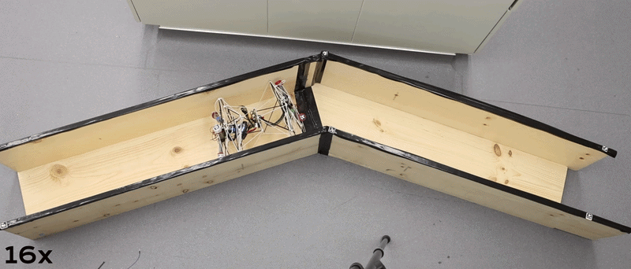
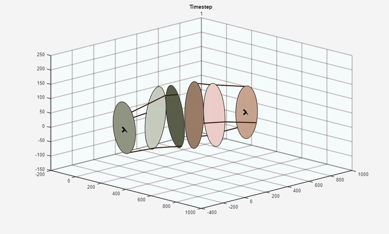

# TensegritySnake

This repository contains the system design documentation and data analysis for **HUTS** (Hyper-redundant Underactuated Tensegrity Snake robot), a six-bar icosahedron tensegrity robot capable of dynamic locomotion via motor-tendon actuators fixed to end modules.

---



### Key Contributions

This work showcases the system design for the tetherless HUTS prototype that is composed of six icosahedrons connected sequentially. We also introduce a failure analysis in the case of actuator loss to highlight the structural redundancy.

- **System Design**: Extremely lightweight (694g) and flexible prototype capable of real-time tetherless locomotion
- **Biologically Inspired Control**: Three locomotion gaits inspired by snake movement were tested: concertina, hybrid conertina, and hybrid sidewinding
- **Redundancy**: Capable of dynamic locomotion even with the loss of two driving tendons
- **Icosahedron Diameter Analysis**: Evaluated change in diameter of each of the six icosahedrons during three gaits
- **Robot Comparison**: Discussion regarding other mobile, tensegrity robots inspired by snake locomotion

---

## Repository Structure

```
TensegritySnake/
├── data_analysis/          # Motion capture data analysis
├── experimental_code/      # Test scripts
├── experimental_data/      # Motion capture data
├── design/                 # HUTS design files
│   ├── CAD/                # Fusion files
│   └── PCB/                # KiCAD files
└── media/                  # Demo figures/videos
```

---

## Getting Started

### Prerequisites

- MATLAB R2020b or later
- Optional: Python 3.x (for hardware integration)

### Installation

1. **Clone the repository**
   ```bash
   git clone https://github.com/lefaris/TensegritySnake.git
   cd TensegritySnake
   ```

2. **Set up MATLAB path**
   ```matlab
   addpath(genpath('data_analysis'))
   ```

3. **Evaluate any of the motion capture data files**
   ```matlab
   cd data_analysis
   run('TS_C_3d_movement_tracking_Vicon')
   ```

---

## Dynamic Analysis



Three biologically inspired locomotion gaits were implemented: concertina, hybrid concertina, and hybrid sidewinding. For each, the motion capture data was reconstructed as shown in the above gif.  For each complete cycle of the gait, the two end absolute positions were recorded. From this data, the minimum, maximum, and average translation and rotation per locomotion gait was calculated with a peak of 0.057 BL/s.

---

## System Design

### Mechanical Properties


### Electronics

